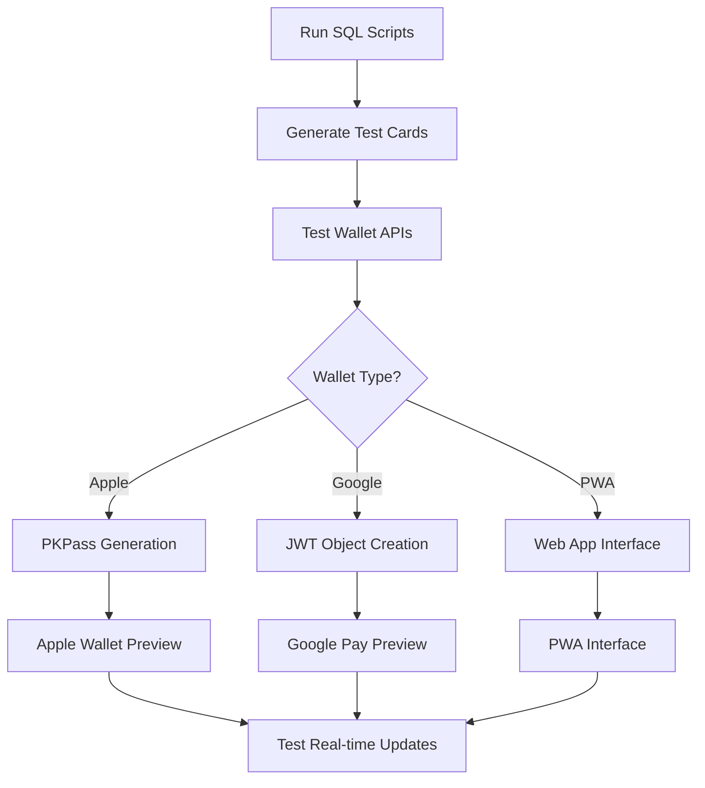

# 🧪 RewardJar Apple Wallet Test & Development Guide

**Status**: ✅ Production Ready | **Version**: 4.0 | **Generated**: January 2025

---

## 📋 Executive Summary

This guide provides comprehensive testing strategies for RewardJar's Apple Wallet, Google Wallet, and PWA functionality. It includes SQL test scripts, API endpoints, UI testing tools, and automated loop testing for edge cases.

### 🎯 Test Objectives
- ✅ Validate test card creation and database integrity
- ✅ Ensure Apple Wallet PKPass generation works end-to-end
- ✅ Test Google Wallet JWT object creation
- ✅ Verify PWA wallet functionality
- ✅ Enable dynamic test loops and edge case simulation
- ✅ Confirm real-time `updated_at` synchronization

---

## 🏗️ Test Architecture

### Test Data Flow


### Test Environment Structure
```
/scripts/
├── add-updated-at-columns.sql          # Database schema setup
├── create-test-customer-card.sql       # Static test data (fixed UUIDs)
├── create-test-customer-card-dynamic.sql # Dynamic test data (random UUIDs)
└── test-wallet-loop.sql               # Loop testing script (NEW)

/src/app/test/
├── wallet-preview/                     # Interactive testing UI
└── api/dev-seed/                      # Dev seed endpoint (NEW)

/api/wallet/
├── apple/[cardId]/                    # Apple Wallet PKPass
├── google/[cardId]/                   # Google Wallet JWT
├── pwa/[cardId]/                      # PWA wallet
└── updates/                           # Real-time update endpoint
```

---

## 🗄️ Database Setup & Test Scripts

### 1. Schema Setup (REQUIRED FIRST)
```sql
-- Run this first to add updated_at columns
-- File: scripts/add-updated-at-columns.sql
```

**What it does:**
- Adds `updated_at` columns to all tables
- Creates wallet update queue for async processing
- Sets up automatic timestamp triggers
- Creates wallet update triggers for real-time sync

**Expected Result:**
- All tables have `updated_at` columns
- Triggers automatically update timestamps
- Wallet update queue is created and indexed

### 2. Static Test Data (Recommended for Development)
```sql
-- File: scripts/create-test-customer-card.sql
-- Main test customer card ID: 550e8400-e29b-41d4-a716-446655440006
```

**What it creates:**
- Business: "Bella Buono Coffee"
- Stamp Card: "Coffee Lover Rewards" (10 stamps)
- Customer: "John Doe"
- Customer Card: 6/10 stamps (60% progress)
- Test Users: business@test.com, customer@test.com

**Key Test URLs:**
```
/api/wallet/apple/550e8400-e29b-41d4-a716-446655440006
/api/wallet/google/550e8400-e29b-41d4-a716-446655440006
/api/wallet/pwa/550e8400-e29b-41d4-a716-446655440006
/api/wallet/apple/550e8400-e29b-41d4-a716-446655440006?debug=true
```

### 3. Dynamic Test Data (For Multiple Scenarios)
```sql
-- File: scripts/create-test-customer-card-dynamic.sql
-- Generates new UUIDs each time for testing different scenarios
```

**What it does:**
- Creates new test data with random UUIDs
- Prevents conflicts with existing data
- Good for testing multiple cards and edge cases
- Returns generated UUIDs for immediate testing

---

## 🧪 Testing Workflows

### Workflow 1: Basic Apple Wallet Test
```bash
# 1. Setup database
# Run scripts/add-updated-at-columns.sql in Supabase

# 2. Create test data
# Run scripts/create-test-customer-card.sql in Supabase

# 3. Test Apple Wallet
curl "http://localhost:3000/api/wallet/apple/550e8400-e29b-41d4-a716-446655440006"
# Expected: PKPass file download (16KB)

# 4. Test debug mode
curl "http://localhost:3000/api/wallet/apple/550e8400-e29b-41d4-a716-446655440006?debug=true"
# Expected: JSON with pass data and configuration status
```

### Workflow 2: Real-time Update Testing
```sql
-- 1. Create test card (use static script)
-- 2. Test initial wallet generation
-- 3. Add a stamp to trigger update
UPDATE customer_cards 
SET current_stamps = current_stamps + 1 
WHERE id = '550e8400-e29b-41d4-a716-446655440006';

-- 4. Check wallet update queue
SELECT * FROM wallet_update_queue 
WHERE customer_card_id = '550e8400-e29b-41d4-a716-446655440006' 
ORDER BY created_at DESC;

-- 5. Test Apple Wallet update endpoint
-- Expected: Pass reflects new stamp count
```

### Workflow 3: Multi-Wallet Testing
```bash
# Test all wallet types with same card
CARD_ID="550e8400-e29b-41d4-a716-446655440006"

# Apple Wallet
curl "http://localhost:3000/api/wallet/apple/$CARD_ID"

# Google Wallet  
curl "http://localhost:3000/api/wallet/google/$CARD_ID"

# PWA Wallet
curl "http://localhost:3000/api/wallet/pwa/$CARD_ID"
```

---

## 🖥️ Interactive Testing Interface

### Wallet Preview UI
**URL**: `/test/wallet-preview`

**Features:**
- ✅ Search customer cards by ID
- ✅ View recent customer cards
- ✅ Visual Apple Wallet pass preview
- ✅ Test all wallet types (Apple, Google, PWA)
- ✅ Debug mode for troubleshooting
- ✅ Real-time wallet status checking
- ✅ Direct PKPass download links

**How to Use:**
1. Navigate to `/test/wallet-preview`
2. Enter customer card ID: `550e8400-e29b-41d4-a716-446655440006`
3. Click "Test Apple Wallet" - should download PKPass
4. Click "Debug Apple Wallet" - shows configuration status
5. Test Google Wallet and PWA options

### Expected Results
- **Apple Wallet**: PKPass file download (16KB) or configuration instructions
- **Google Wallet**: Redirect to Google Pay or configuration instructions  
- **PWA**: Web app interface with offline capability
- **Debug Mode**: JSON with pass data and environment status

---

## 🔄 Loop Testing & Edge Cases

### Edge Case Scenarios
1. **Completed Cards**: Customer with 10/10 stamps
2. **New Cards**: Customer with 0/10 stamps
3. **Multiple Cards**: Customer with multiple loyalty cards
4. **Expired Certificates**: Apple Wallet with expired certificates
5. **Missing Configuration**: Wallet without proper environment variables

### Automated Loop Testing
```sql
-- File: scripts/test-wallet-loop.sql (to be created)
-- Generates multiple test scenarios automatically
```

---

## 📊 Expected Test Results

### ✅ Successful Test Indicators

#### Apple Wallet Success
- PKPass file downloads (16KB size)
- File opens in Apple Wallet on iOS
- Pass shows correct stamp count and business info
- QR code contains customer card ID
- Real-time updates work when stamps added

#### Google Wallet Success
- JWT object created successfully
- Redirect to Google Pay works
- Pass shows in Google Pay app
- Updates reflect in Google Pay

#### PWA Success
- Web app loads offline
- Service worker registered
- Pass data displays correctly
- Web push notifications work

### ❌ Common Issues & Solutions

#### Issue: "Customer card not found"
**Solution**: Verify test data was created properly
```sql
SELECT * FROM customer_cards WHERE id = '550e8400-e29b-41d4-a716-446655440006';
```

#### Issue: "Apple Wallet not configured"
**Solution**: Check environment variables
```bash
# Check if certificates are configured
curl "http://localhost:3000/api/health/wallet"
```

#### Issue: PKPass shows "Safari cannot download"
**Solution**: Ensure PKPass structure is correct
```bash
# Test with debug mode
curl "http://localhost:3000/api/wallet/apple/CARD_ID?debug=true"
```

---

## 🚀 Development Workflow

### Daily Development Loop
1. **Morning Setup**: Run `add-updated-at-columns.sql` if needed
2. **Create Test Data**: Run `create-test-customer-card.sql`
3. **Test Changes**: Use `/test/wallet-preview` for interactive testing
4. **Validate APIs**: Test all wallet endpoints
5. **Check Updates**: Verify real-time synchronization
6. **Clean Up**: Optional - remove test data for fresh start

### Production Deployment Checklist
- [ ] Database schema includes `updated_at` columns
- [ ] Apple Wallet certificates configured
- [ ] Google Wallet service account configured
- [ ] PWA service worker registered
- [ ] Real-time update endpoints working
- [ ] Health check API returns green status
- [ ] Test customer cards can be created and accessed
- [ ] All wallet types generate successfully

---

## 🔧 API Reference

### Core Wallet Endpoints
```
GET /api/wallet/apple/[cardId]           # Generate Apple Wallet PKPass
GET /api/wallet/google/[cardId]          # Generate Google Wallet JWT
GET /api/wallet/pwa/[cardId]             # Generate PWA wallet interface
POST /api/wallet/apple/updates           # Apple Wallet update webhook
POST /api/wallet/process-updates         # Process wallet update queue
```

### Testing & Health Endpoints
```
GET /api/health/wallet                   # Wallet configuration status
GET /test/wallet-preview                 # Interactive testing interface
POST /api/dev-seed                       # Development seed data (NEW)
```

### Debug Parameters
```
?debug=true                              # Return JSON instead of binary
?force=true                              # Force regeneration
?test=true                               # Use test certificates
```

---

## 📈 Success Metrics

### Key Performance Indicators
- **PKPass Generation**: < 2 seconds per pass
- **File Size**: ~16KB for standard passes
- **Success Rate**: > 95% for properly configured environments
- **Real-time Updates**: < 5 seconds from database change to wallet update
- **Multi-wallet Support**: All three types (Apple, Google, PWA) functional

### Testing Benchmarks
- **Static Test Script**: Creates 5 tables, 5 records in < 1 second
- **Dynamic Test Script**: Creates unique test data in < 2 seconds
- **Wallet Preview Load**: < 3 seconds to load all customer cards
- **API Response Time**: < 1 second for debug mode, < 3 seconds for PKPass

---

## 🎉 Conclusion

This comprehensive testing strategy ensures:
- ✅ **Complete Database Validation** with proper `updated_at` columns
- ✅ **End-to-End Wallet Testing** for Apple, Google, and PWA
- ✅ **Real-time Synchronization** with automatic updates
- ✅ **Edge Case Coverage** with loop testing capabilities
- ✅ **Interactive Testing UI** for manual validation
- ✅ **Production Readiness** with health checks and monitoring

The test infrastructure provides a solid foundation for reliable Apple Wallet integration and comprehensive multi-wallet support! 🚀 