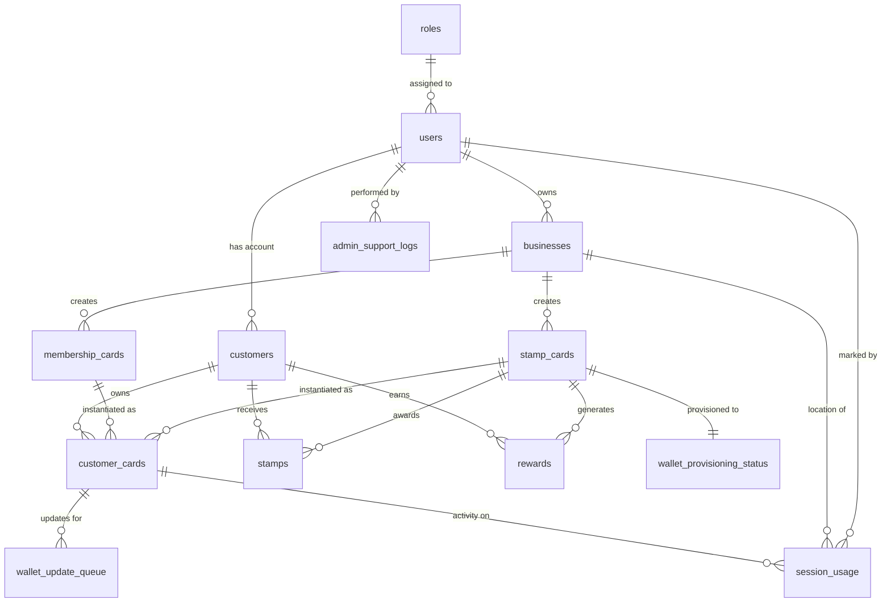

# RewardJar 4.0 Database Schema Documentation

*Generated on: January 8, 2025*  
*Database: PostgreSQL via Supabase*  
*Schema Version: Production Ready*

## 📋 Overview

This document provides a comprehensive overview of the RewardJar 4.0 database schema, including all tables, columns, constraints, relationships, and business logic.

## 🔗 Quick Navigation

- [Core Tables](#core-tables)
- [Authentication & Users](#authentication--users)
- [Business Management](#business-management) 
- [Card System](#card-system)
- [Customer Management](#customer-management)
- [Wallet Integration](#wallet-integration)
- [Session & Usage Tracking](#session--usage-tracking)
- [Admin & Support](#admin--support)
- [Performance & Testing](#performance--testing)
- [Relationships Diagram](#relationships-diagram)
- [Constraints & Validation](#constraints--validation)

---

## 🗄️ Core Tables

### 1. `users` - Authentication & Role Management

**Purpose**: Central authentication table linked to Supabase Auth with role-based access control.

| Column | Type | Constraints | Description |
|--------|------|-------------|-------------|
| `id` | `uuid` | **PRIMARY KEY**, NOT NULL | Supabase auth user ID |
| `email` | `text` | NOT NULL | User email address |
| `role_id` | `integer` | NOT NULL, CHECK (role_id IN (1,2,3)) | User role: 1=Admin, 2=Business, 3=Customer |
| `created_at` | `timestamptz` | DEFAULT now() | Account creation timestamp |

**Relationships**:
- ✅ Links to `auth.users` (Supabase Auth)
- ✅ Referenced by `businesses.owner_id`
- ✅ Referenced by `customers.user_id`
- ✅ Referenced by `session_usage.marked_by`
- ✅ Referenced by `admin_support_logs.admin_id`

**Business Rules**:
- Role 1 (Admin): Full system access
- Role 2 (Business): Manage own business and cards
- Role 3 (Customer): Access own loyalty cards and rewards

---

### 2. `roles` - Role Definitions

**Purpose**: Defines system roles for access control.

| Column | Type | Constraints | Description |
|--------|------|-------------|-------------|
| `id` | `integer` | **PRIMARY KEY** | Role identifier |
| `name` | `text` | NOT NULL, UNIQUE | Role name (admin, business, customer) |

**Data**:
- `1` → `admin`
- `2` → `business` 
- `3` → `customer`

---

## 🏢 Business Management

### 3. `businesses` - Business Profiles

**Purpose**: Store business information and profile data for card creators.

| Column | Type | Constraints | Description |
|--------|------|-------------|-------------|
| `id` | `uuid` | **PRIMARY KEY**, DEFAULT uuid_generate_v4() | Business unique identifier |
| `name` | `text` | NOT NULL | Business name |
| `description` | `text` | NULL | Business description |
| `contact_email` | `text` | NULL | Business contact email |
| `owner_id` | `uuid` | **NOT NULL**, **FK** → `users.id` | Business owner (user) |
| `status` | `text` | DEFAULT 'active', CHECK (status IN ('active','inactive')) | Business status |
| `created_at` | `timestamptz` | DEFAULT now() | Business registration date |
| `updated_at` | `timestamptz` | DEFAULT now() | Last profile update |
| `profile_progress` | `integer` | DEFAULT 20, CHECK (0 ≤ profile_progress ≤ 100) | Profile completion percentage |
| `location` | `text` | NULL | Business address/location |
| `website_url` | `text` | NULL | Business website |
| `logo_url` | `text` | NULL | Business logo image URL |
| `contact_number` | `text` | NULL | Business phone number |
| `store_numbers` | `text` | NULL | Store/branch numbers (2-3 numbers) |
| `is_flagged` | `boolean` | DEFAULT false | Admin flagged for review |
| `admin_notes` | `text` | NULL | Admin internal notes |
| `card_requested` | `boolean` | DEFAULT false | Card creation requested |
| `latitude` | `numeric` | NULL | Location latitude (Google Places) |
| `longitude` | `numeric` | NULL | Location longitude (Google Places) |
| `place_id` | `text` | NULL | Google Places ID |
| `formatted_address` | `text` | NULL | Full Google Places address |

**Relationships**:
- ✅ Referenced by `stamp_cards.business_id`
- ✅ Referenced by `membership_cards.business_id`
- ✅ Referenced by `session_usage.business_id`

---

## 🎴 Card System

### 4. `stamp_cards` - Stamp-Based Loyalty Cards

**Purpose**: Define stamp collection loyalty programs (e.g., "Buy 10 coffees, get 1 free").

| Column | Type | Constraints | Description |
|--------|------|-------------|-------------|
| `id` | `uuid` | **PRIMARY KEY**, DEFAULT uuid_generate_v4() | Card template ID |
| `business_id` | `uuid` | **NOT NULL**, **FK** → `businesses.id` | Owning business |
| `name` | `text` | NOT NULL | Card name/title |
| `total_stamps` | `integer` | **NOT NULL**, CHECK (total_stamps > 0 AND total_stamps ≤ 50) | Required stamps for reward |
| `reward_description` | `text` | NOT NULL | Reward description |
| `status` | `text` | DEFAULT 'active', CHECK (status IN ('active','inactive')) | Card availability |
| `created_at` | `timestamptz` | DEFAULT now() | Card creation date |
| `updated_at` | `timestamptz` | DEFAULT now() | Last modification |
| `card_color` | `text` | DEFAULT '#8B4513' | Hex color for card UI |
| `icon_emoji` | `text` | DEFAULT '☕' | Emoji icon for display |
| `expiry_days` | `integer` | DEFAULT 60, CHECK (expiry_days > 0) | Customer card expiry period |
| `reward_expiry_days` | `integer` | DEFAULT 15, CHECK (reward_expiry_days > 0) | Reward validity period |
| `stamp_config` | `jsonb` | DEFAULT '{"minSpendAmount": 0, "manualStampOnly": true, "maxStampsPerDay": 1, "billProofRequired": false, "duplicateVisitBuffer": "12h"}' | Stamp rules configuration |
| `barcode_type` | `text` | DEFAULT 'QR_CODE', CHECK (barcode_type IN ('PDF417','QR_CODE')) | Barcode format |
| `card_name` | `text` | NULL | Alternative card name |
| `reward` | `text` | NULL | Short reward name |
| `stamps_required` | `integer` | NULL, CHECK (stamps_required > 0 AND stamps_required ≤ 20) | Alternative stamps field |
| `card_expiry_days` | `integer` | DEFAULT 60, CHECK (card_expiry_days > 0) | Card expiry period |
| `card_description` | `text` | DEFAULT 'Collect stamps to get rewards' | Card description text |
| `how_to_earn_stamp` | `text` | DEFAULT 'Buy anything to get a stamp' | Instructions for earning |
| `reward_details` | `text` | DEFAULT '' | Detailed reward info |
| `earned_stamp_message` | `text` | DEFAULT 'Just [#] more stamps to get your reward!' | Progress message |
| `earned_reward_message` | `text` | DEFAULT 'Reward is earned and waiting for you!' | Completion message |

**Relationships**:
- ✅ Referenced by `customer_cards.stamp_card_id`
- ✅ Referenced by `stamps.stamp_card_id`
- ✅ Referenced by `rewards.stamp_card_id`
- ✅ Referenced by `wallet_provisioning_status.card_id`

---

### 5. `membership_cards` - Session-Based Membership Cards

**Purpose**: Define session-based memberships (e.g., gym passes, spa packages).

| Column | Type | Constraints | Description |
|--------|------|-------------|-------------|
| `id` | `uuid` | **PRIMARY KEY**, DEFAULT uuid_generate_v4() | Membership template ID |
| `business_id` | `uuid` | **NOT NULL**, **FK** → `businesses.id` | Owning business |
| `name` | `text` | NOT NULL | Membership name |
| `membership_type` | `text` | NOT NULL, DEFAULT 'gym', CHECK (membership_type IN ('gym','club','subscription','vip_access','spa','coworking')) | Membership category |
| `total_sessions` | `integer` | **NOT NULL**, CHECK (total_sessions > 0) | Total available sessions |
| `cost` | `numeric` | NOT NULL | Membership price |
| `duration_days` | `integer` | DEFAULT 365 | Membership validity period |
| `status` | `text` | DEFAULT 'active', CHECK (status IN ('active','inactive')) | Membership availability |
| `created_at` | `timestamptz` | DEFAULT now() | Template creation |
| `updated_at` | `timestamptz` | DEFAULT now() | Last modification |
| `card_color` | `text` | DEFAULT '#8B5CF6' | Card background color |
| `icon_emoji` | `text` | DEFAULT '💳' | Display icon |
| `barcode_type` | `text` | DEFAULT 'QR_CODE', CHECK (barcode_type IN ('PDF417','QR_CODE')) | Barcode format |
| `card_description` | `text` | DEFAULT 'Access premium services with your membership' | Card description |
| `how_to_use_card` | `text` | DEFAULT 'Show this card for access and session tracking' | Usage instructions |
| `membership_details` | `text` | DEFAULT 'Membership includes access to all services' | Membership benefits |
| `session_used_message` | `text` | DEFAULT 'Session recorded! {#} sessions remaining' | Session tracking message |
| `membership_expired_message` | `text` | DEFAULT 'Your membership has expired. Please renew to continue' | Expiry message |
| `membership_config` | `jsonb` | DEFAULT '{"accessControl": true, "sessionBuffer": "1h", "membershipTier": "standard", "allowGuestAccess": false, "autoSessionTracking": true}' | Membership rules |
| `card_expiry_days` | `integer` | DEFAULT 365, CHECK (card_expiry_days > 0) | Card validity period |

**Relationships**:
- ✅ Referenced by `customer_cards.membership_card_id`

---

## 👥 Customer Management

### 6. `customers` - Customer Profiles

**Purpose**: Store customer information and link to user accounts.

| Column | Type | Constraints | Description |
|--------|------|-------------|-------------|
| `id` | `uuid` | **PRIMARY KEY**, DEFAULT uuid_generate_v4() | Customer unique ID |
| `user_id` | `uuid` | **NOT NULL**, **FK** → `users.id` | Associated user account |
| `name` | `text` | NOT NULL | Customer full name |
| `email` | `text` | NULL | Customer email |
| `phone` | `text` | NULL | Customer phone number |
| `created_at` | `timestamptz` | DEFAULT now() | Registration date |
| `updated_at` | `timestamptz` | DEFAULT now() | Profile last updated |

**Relationships**:
- ✅ Referenced by `customer_cards.customer_id`
- ✅ Referenced by `stamps.customer_id`
- ✅ Referenced by `rewards.customer_id`

---

### 7. `customer_cards` - Customer Card Instances

**Purpose**: Link customers to specific card instances with progress tracking.

| Column | Type | Constraints | Description |
|--------|------|-------------|-------------|
| `id` | `uuid` | **PRIMARY KEY**, DEFAULT uuid_generate_v4() | Card instance ID |
| `customer_id` | `uuid` | **NOT NULL**, **FK** → `customers.id` | Card owner |
| `stamp_card_id` | `uuid` | NULL, **FK** → `stamp_cards.id` | Stamp card reference (NULL for membership) |
| `membership_card_id` | `uuid` | NULL, **FK** → `membership_cards.id` | Membership card reference (NULL for stamps) |
| `current_stamps` | `integer` | DEFAULT 0, CHECK (current_stamps ≥ 0) | Current stamp count |
| `wallet_type` | `text` | NULL, CHECK (wallet_type IN ('apple','google','pwa')) | Wallet platform |
| `wallet_pass_id` | `text` | NULL | Platform-specific pass ID |
| `sessions_used` | `integer` | DEFAULT 0 | Sessions consumed (for memberships) |
| `expiry_date` | `timestamptz` | NULL | Card expiration date |
| `created_at` | `timestamptz` | DEFAULT now() | Card issued date |
| `updated_at` | `timestamptz` | DEFAULT now() | Last activity |

**Business Rules**:
- Either `stamp_card_id` OR `membership_card_id` must be set (not both)
- `current_stamps` used for stamp cards
- `sessions_used` used for membership cards

**Relationships**:
- ✅ Referenced by `session_usage.customer_card_id`
- ✅ Referenced by `wallet_update_queue.customer_card_id`

---

## 🎯 Reward & Activity Tracking

### 8. `stamps` - Individual Stamp Records

**Purpose**: Track individual stamp awards for audit and analytics.

| Column | Type | Constraints | Description |
|--------|------|-------------|-------------|
| `id` | `uuid` | **PRIMARY KEY**, DEFAULT uuid_generate_v4() | Stamp record ID |
| `customer_id` | `uuid` | **NOT NULL**, **FK** → `customers.id` | Stamp recipient |
| `stamp_card_id` | `uuid` | **NOT NULL**, **FK** → `stamp_cards.id` | Source card |
| `created_at` | `timestamptz` | DEFAULT now() | Stamp awarded time |
| `updated_at` | `timestamptz` | DEFAULT now() | Record modified |

---

### 9. `rewards` - Earned Rewards

**Purpose**: Track completed rewards and redemption status.

| Column | Type | Constraints | Description |
|--------|------|-------------|-------------|
| `id` | `uuid` | **PRIMARY KEY**, DEFAULT uuid_generate_v4() | Reward record ID |
| `customer_id` | `uuid` | **NOT NULL**, **FK** → `customers.id` | Reward owner |
| `stamp_card_id` | `uuid` | **NOT NULL**, **FK** → `stamp_cards.id` | Source card |
| `redeemed_at` | `timestamptz` | NULL | Redemption timestamp |
| `created_at` | `timestamptz` | DEFAULT now() | Reward earned date |
| `updated_at` | `timestamptz` | DEFAULT now() | Status last updated |

---

### 10. `session_usage` - Session/Stamp Activity Log

**Purpose**: Universal activity tracking for both stamp awards and session usage.

| Column | Type | Constraints | Description |
|--------|------|-------------|-------------|
| `id` | `uuid` | **PRIMARY KEY**, DEFAULT uuid_generate_v4() | Activity record ID |
| `customer_card_id` | `uuid` | **NOT NULL**, **FK** → `customer_cards.id` | Associated card |
| `business_id` | `uuid` | **NOT NULL**, **FK** → `businesses.id` | Location/business |
| `marked_by` | `uuid` | NULL, **FK** → `users.id` | Staff member who recorded |
| `session_date` | `timestamptz` | DEFAULT now() | Activity timestamp |
| `usage_type` | `text` | NOT NULL, DEFAULT 'session', CHECK (usage_type IN ('session','stamp')) | Activity type |
| `notes` | `text` | NULL | Additional notes |
| `created_at` | `timestamptz` | DEFAULT now() | Record created |

---

## 📱 Wallet Integration

### 11. `wallet_update_queue` - Async Wallet Updates

**Purpose**: Queue system for processing wallet pass updates asynchronously.

| Column | Type | Constraints | Description |
|--------|------|-------------|-------------|
| `id` | `uuid` | **PRIMARY KEY**, DEFAULT uuid_generate_v4() | Queue item ID |
| `customer_card_id` | `uuid` | **NOT NULL**, **FK** → `customer_cards.id` | Target card |
| `update_type` | `text` | NOT NULL, CHECK (update_type IN ('stamp_update','reward_complete','card_update','session_update','membership_update')) | Update category |
| `processed` | `boolean` | DEFAULT false | Processing status |
| `processed_at` | `timestamptz` | NULL | Processing completion |
| `failed` | `boolean` | DEFAULT false | Failure flag |
| `error_message` | `text` | NULL | Error details |
| `metadata` | `jsonb` | DEFAULT '{}' | Additional update data |
| `created_at` | `timestamptz` | DEFAULT now() | Queue entry time |
| `updated_at` | `timestamptz` | DEFAULT now() | Status last updated |

---

### 12. `wallet_provisioning_status` - Wallet Platform Status

**Purpose**: Track wallet pass provisioning status across platforms.

| Column | Type | Constraints | Description |
|--------|------|-------------|-------------|
| `id` | `uuid` | **PRIMARY KEY**, DEFAULT gen_random_uuid() | Status record ID |
| `card_id` | `uuid` | **NOT NULL**, UNIQUE, **FK** → `stamp_cards.id` | Associated card |
| `apple_status` | `text` | DEFAULT 'pending', CHECK (apple_status IN ('pending','provisioned','failed','not_supported')) | Apple Wallet status |
| `google_status` | `text` | DEFAULT 'pending', CHECK (google_status IN ('pending','provisioned','failed','not_supported')) | Google Wallet status |
| `pwa_status` | `text` | DEFAULT 'pending', CHECK (pwa_status IN ('pending','provisioned','failed','not_supported')) | PWA status |
| `last_updated` | `timestamptz` | DEFAULT now() | Status last changed |
| `metadata` | `jsonb` | DEFAULT '{}' | Platform-specific data |
| `created_at` | `timestamptz` | DEFAULT now() | Record created |

---

### 13. `wallet_devices` – Registered Devices (Apple/Google Web Service)

**Purpose**: Store device identifiers and push tokens for wallet push notifications.

| Column | Type | Constraints | Description |
|--------|------|-------------|-------------|
| `id` | `uuid` | **PRIMARY KEY**, DEFAULT gen_random_uuid() | Device record ID |
| `device_library_identifier` | `text` | **UNIQUE**, NOT NULL | Apple device library identifier |
| `push_token` | `text` | NOT NULL | Device push token |
| `platform` | `text` | DEFAULT 'ios', CHECK (platform IN ('ios','android','web')) | Platform |
| `created_at` | `timestamptz` | DEFAULT now() | Created |
| `updated_at` | `timestamptz` | DEFAULT now() | Updated |

---

### 14. `wallet_passes` – Pass Registry

**Purpose**: Track pass type/serial and update tag for change feeds.

| Column | Type | Constraints | Description |
|--------|------|-------------|-------------|
| `id` | `uuid` | **PRIMARY KEY**, DEFAULT gen_random_uuid() | Pass record ID |
| `pass_type_id` | `text` | NOT NULL | Apple/Google pass class/type ID |
| `serial_number` | `text` | NOT NULL | Pass serial |
| `update_tag` | `bigint` | DEFAULT 1, NOT NULL | Monotonic version for changes |
| `card_type` | `text` | CHECK (card_type IN ('stamp','membership')) | Internal type |
| `card_id` | `uuid` | NULL | Linked card template |
| `created_at` | `timestamptz` | DEFAULT now() | Created |
| `updated_at` | `timestamptz` | DEFAULT now() | Updated |

Indexes:
- `idx_wallet_passes_update_tag (update_tag)`
- `idx_wallet_passes_type_serial (pass_type_id, serial_number)`

---

### 15. `wallet_registrations` – Device↔Pass Links

**Purpose**: Many-to-many relation between devices and passes for push updates.

| Column | Type | Constraints | Description |
|--------|------|-------------|-------------|
| `device_id` | `uuid` | **FK** → `wallet_devices.id`, NOT NULL | Device |
| `pass_id` | `uuid` | **FK** → `wallet_passes.id`, NOT NULL | Pass |
| `created_at` | `timestamptz` | DEFAULT now() | Linked at |

Primary Key: (`device_id`, `pass_id`)

---

## 🛠️ Admin & Support

### 13. `admin_support_logs` - Admin Action Audit

**Purpose**: Log all administrative actions for audit and compliance.

| Column | Type | Constraints | Description |
|--------|------|-------------|-------------|
| `id` | `uuid` | **PRIMARY KEY**, DEFAULT uuid_generate_v4() | Log entry ID |
| `admin_id` | `uuid` | **NOT NULL**, **FK** → `users.id` | Admin user |
| `action` | `text` | NOT NULL, CHECK (action IN ('add_stamp','remove_stamp','reset_card','extend_membership','add_sessions','reset_sessions','force_reward','mark_redeemed','flag_business','unflag_business','impersonate_business','edit_business_profile')) | Action type |
| `target_type` | `text` | NOT NULL, CHECK (target_type IN ('customer','business','card')) | Target entity type |
| `target_id` | `uuid` | NOT NULL | Target entity ID |
| `target_name` | `text` | NOT NULL | Target entity name |
| `comment` | `text` | NOT NULL | Admin comment/reason |
| `metadata` | `jsonb` | DEFAULT '{}' | Additional context |
| `created_at` | `timestamptz` | DEFAULT now() | Action timestamp |

---

## 🧪 Performance & Testing

### 16. `test_results` - Performance Test Data

**Purpose**: Store wallet generation performance metrics and test results.

| Column | Type | Constraints | Description |
|--------|------|-------------|-------------|
| `id` | `uuid` | **PRIMARY KEY**, DEFAULT gen_random_uuid() | Test result ID |
| `card_id` | `uuid` | NULL | Associated card (if applicable) |
| `test_type` | `varchar` | NOT NULL | Test category (apple, google, pwa) |
| `status` | `varchar` | NOT NULL | Result status (success, error, pending) |
| `duration_ms` | `integer` | DEFAULT 0 | Test duration in milliseconds |
| `response_size_kb` | `integer` | DEFAULT 0 | Response size in kilobytes |
| `error_message` | `text` | NULL | Error details |
| `test_url` | `text` | NULL | Tested URL |
| `created_at` | `timestamptz` | DEFAULT now() | Test execution time |

---

## 🔗 Entity Relationships Diagram

---

## ✅ Constraints & Validation Rules

### Business Logic Constraints

1. **User Roles**: Must be 1 (Admin), 2 (Business), or 3 (Customer)
2. **Card Types**: Customer cards must reference either stamp_card_id OR membership_card_id (not both)
3. **Stamp Limits**: 
   - Stamp cards: 1-50 total stamps required
   - Daily limits via stamp_config JSON
4. **Status Values**: 'active' or 'inactive' for businesses and cards
5. **Wallet Types**: 'apple', 'google', or 'pwa'
6. **Update Types**: Specific wallet update categories
7. **Membership Types**: Predefined categories (gym, spa, club, etc.)

### Data Integrity

- **Foreign Keys**: All relationships properly constrained
- **NOT NULL**: Critical fields cannot be empty
- **CHECK Constraints**: Range and value validation
- **UNIQUE Constraints**: Prevent duplicates where needed
- **DEFAULT Values**: Sensible defaults for optional fields

### Performance Optimizations

- **Primary Keys**: UUID v4 for distributed systems
- **Indexes**: Automatic on foreign keys and primary keys
- **Timestamp Tracking**: created_at/updated_at on all entities
- **JSON Configurations**: Flexible rule storage

---

## 🚀 Schema Updates & Migrations

### Recent Changes (January 8, 2025)

1. **Added `phone` column** to `customers` table
2. **Fixed NOT NULL constraints** in test data generation
3. **Enhanced wallet provisioning** status tracking
4. **Improved constraint validation** across all tables

### Migration History

All schema changes are tracked through Supabase migrations with rollback capabilities.

---

## 📊 Current Statistics

Based on schema analysis:

- **Total Tables**: 14
- **Core Entities**: 6 (users, businesses, cards, customers)
- **Support Tables**: 8 (queues, logs, status tracking)
- **Total Relationships**: 23 foreign key constraints
- **JSON Configurations**: 3 tables with JSONB fields
- **Audit Capability**: Full admin action logging

---

## 🔐 Security Features

- **Row Level Security (RLS)**: Enabled on all tables
- **Role-Based Access**: Three-tier permission system
- **Audit Logging**: Complete admin action tracking
- **Data Isolation**: Customers see only their data
- **Business Isolation**: Businesses manage only their entities

---

*This schema documentation is automatically updated with each database change.*  
*For technical support, contact the RewardJar 4.0 development team.*