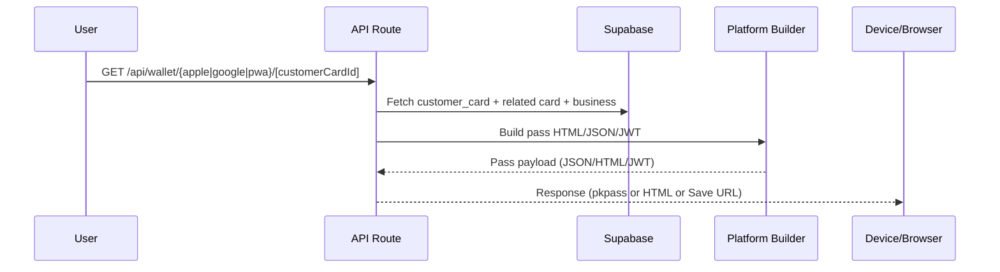

## RewardJar Wallet Card Creation — End-to-End Trace

This report maps modules, components, and functions that participate in wallet card creation across Apple Wallet, Google Wallet, and PWA. It traces data flow, highlights overlaps, and lists fields rendered on card fronts/backs.

### High-level flow



---

## 1) Card Creation Flow

### 1.1 Apple Wallet (PKPass JSON + optional binary)

- Route handler and core flow:
```33:47:src/app/api/wallet/apple/[customerCardId]/route.ts
export async function GET(
  request: NextRequest,
  { params }: { params: Promise<{ customerCardId: string }> }
) {
  const resolvedParams = await params
  const supabase = createAdminClient()
  const customerCardId = resolvedParams.customerCardId
}
```

- Fetch unified customer card including related card and business:
```46:83:src/app/api/wallet/apple/[customerCardId]/route.ts
const { data: customerCard } = await supabase
  .from('customer_cards')
  .select(`
    id, current_stamps, sessions_used,
    stamp_card_id, membership_card_id, expiry_date,
    stamp_cards ( id, name, total_stamps, reward_description, card_color, icon_emoji, businesses ( name, description ) ),
    membership_cards ( id, name, total_sessions, cost, card_color, icon_emoji, businesses ( name, description ) )
  `)
  .eq('id', customerCardId)
  .single()
```

- Compute derived metrics (progress, remaining, labels) and build pass JSON via centralized builder:
```133:158:src/app/api/wallet/apple/[customerCardId]/route.ts
if (isMembershipCard) { /* sessionsUsed/totalSessions, isCompleted, remaining, labels */ }
else { /* current_stamps/total_stamps, isCompleted, remaining, labels */ }
```

```160:186:src/app/api/wallet/apple/[customerCardId]/route.ts
const basePass = buildApplePassJson({
  customerCardId,
  isMembershipCard,
  cardData: { name, total_stamps, reward_description, card_color },
  businessData: { name, description },
  derived: { progressLabel, remainingLabel, primaryValue, progressPercent, remainingCount, isCompleted, isExpired, membershipCost, membershipTotalSessions, membershipExpiryDate }
})
```

- Merge barcodes, webServiceURL and finalize payload; optionally sign and stream `.pkpass` if certificates exist:
```188:205:src/app/api/wallet/apple/[customerCardId]/route.ts
const passData = {
  ...basePass,
  ...buildAppleBarcode(customerCardId, { altTextPrefix: isMembershipCard ? 'Membership ID' : 'Card ID' }),
  webServiceURL: getAppleWebServiceUrl(),
  authenticationToken: customerCardId,
  userInfo: { customerCardId, stampCardId: (cardData as any).id, businessName: businessData.name, cardType: isMembershipCard ? 'membership' : 'stamp' },
  relevantDate: new Date().toISOString(),
  ...(isMembershipCard && customerCard.expiry_date && { expirationDate: customerCard.expiry_date })
}
```

- Apple pass JSON structure (front/back fields) is centralized here:
```69:171:src/lib/wallet/builders/apple-pass-builder.ts
const storeCard = {
  primaryFields: [{ key: isMembershipCard ? 'sessions' : 'stamps', label: derived.progressLabel, value: derived.primaryValue }],
  secondaryFields: [ { key: 'progress', value: `${Math.round(derived.progressPercent)}%` }, { key: 'remaining', value: derived.isCompleted ? (isMembershipCard ? 'Complete' : 'Completed!') : `${derived.remainingCount} ...` } ],
  auxiliaryFields: [ { key: 'business', value: businessData.name }, isMembershipCard ? { key: 'cost', value: `₩${(input.derived.membershipCost ?? 15000).toLocaleString()}` } : { key: 'reward', value: cardData.reward_description } ],
  headerFields: [{ key: 'card_name', label: isMembershipCard ? 'Membership' : 'Stamp Card', value: cardData.name }],
  backFields: [ { key: 'description', ... }, { key: 'business_info', ... }, { key: 'instructions', ... }, optional expiry_info ]
}
```

### 1.2 Google Wallet (Loyalty Object + Save URL)

- Route handler:
```14:21:src/app/api/wallet/google/[customerCardId]/route.ts
export async function GET(_req, { params }) {
  const { customerCardId } = await params
}
```

- Data fetch and object IDs:
```27:66:src/app/api/wallet/google/[customerCardId]/route.ts
const { data: customerCard } = await supabase.from('customer_cards').select('*').eq('id', customerCardId).single()
// fetch stamp_cards/membership_cards then business
const ids = buildGoogleIds(customerCardId, undefined, isMembershipCard)
```

- Loyalty object and JWT:
```73:79:src/app/api/wallet/google/[customerCardId]/route.ts
const loyaltyObject = createLoyaltyObject({ ids, current: customerCard.current_stamps || 0, total: cardData?.total_stamps || cardData?.stamps_required || 10, ... })
```

```70:101:src/lib/wallet/builders/google-pass-builder.ts
export function createSaveToWalletJwt(loyaltyObject: LoyaltyObject): string { /* signs RS256 JWT */ }
export function buildSaveUrl(jwt: string): string { return `https://pay.google.com/gp/v/save/${jwt}` }
```

### 1.3 Progressive Web App (Static HTML Pass)

- Route handler and data resolution:
```6:22:src/app/api/wallet/pwa/[customerCardId]/route.ts
export async function GET(_req, { params }) { const { customerCardId } = await params; /* fetch customer_cards */ }
```

- Stamp vs membership branch and builder usage:
```120:144:src/app/api/wallet/pwa/[customerCardId]/route.ts
const html = buildPwaHtml(
  isMembershipCard ? { type: 'membership', businessName, cardName, cardColor, sessionsUsed, totalSessions, cost, expiryDate, qrCodeDataUrl }
                   : { type: 'stamp', businessName, cardName, cardColor, iconEmoji, currentStamps, totalStamps, rewardDescription, qrCodeDataUrl }
)
```

- PWA HTML builder templates:
```49:107:src/lib/wallet/builders/pwa-pass-builder.ts
// Stamp: 5x2 grid, progress text, optional reward text, QR
```
```110:165:src/lib/wallet/builders/pwa-pass-builder.ts
// Membership: sessions bar, optional cost + expiry, QR
```

---

## 2) Stamp & Membership Integration Points

- Apple: integration at derived metrics and field selection.
```133:158:src/app/api/wallet/apple/[customerCardId]/route.ts
// membership: sessionsUsed/totalSessions; stamp: current_stamps/total_stamps
```
```69:117:src/lib/wallet/builders/apple-pass-builder.ts
// auxiliaryFields switches between cost (membership) and reward (stamp)
```

- Google: IDs include membership suffix, but loyalty object uses stamp counts.
```68:79:src/app/api/wallet/google/[customerCardId]/route.ts
// isMembershipCard influences IDs only; points still `${current_stamps}/${total_stamps}`
```

- PWA: explicit branching and parameter contracts for each type.
```120:144:src/app/api/wallet/pwa/[customerCardId]/route.ts
// chooses membership vs stamp params for buildPwaHtml
```

---

## 3) Platform Variations

- Apple Wallet
  - Pass style: `storeCard` with primary/secondary/auxiliary/header/back fields.
  - Type-specific labels and colors; optional `expirationDate`.
  - Barcode altText differs by type.

- Google Wallet
  - Uses a single Loyalty Object with `loyaltyPoints.balance = "current/total"` and a QR code barcode.
  - No type-specific field differences in current implementation (see Overlaps/Issues).

- PWA
  - Stamp: grid of stars, `current/total`, optional reward text.
  - Membership: progress bar, `sessionsUsed/totalSessions`, optional cost and expiry.

---

## 4) Data Entering Templates (Front/Back)

### Apple (builder input → visible fields)

- Input shape:
```4:28:src/lib/wallet/builders/apple-pass-builder.ts
type ApplePassInput = {
  customerCardId,
  isMembershipCard,
  cardData: { name, total_stamps?, reward_description?, card_color? },
  businessData: { name, description? },
  derived: { progressLabel, remainingLabel, primaryValue, progressPercent, remainingCount, isCompleted, isExpired?, membershipCost?, membershipTotalSessions?, membershipExpiryDate? }
}
```

- Front (storeCard):
  - primaryFields: `label=progressLabel`, `value=primaryValue` [sessions or stamps].
  - secondaryFields: `progress %`, `remaining` or `Completed!`.
  - auxiliaryFields: `business` and either `cost` (membership) or `reward` (stamp).
  - headerFields: `card_name` with `Membership` or `Stamp Card` label + `name`.

- Back (backFields):
  - `description`: membership text includes total sessions and value; stamp text includes total stamps and reward.
  - `business_info`: business name + description.
  - `instructions`: type-specific usage.
  - Optional `expiry_info` if membership expiry present.

### Google

- Input: constructed `LoyaltyObject` with:
  - `loyaltyPoints.label = 'Points'`, `balance.string = current/total` (from stamps paths).
  - `barcode.value = objectDisplayId` (customerCardId), `accountName`, `accountId`.

### PWA

- Stamp params → HTML shows: `businessName`, `cardName`, stars grid (size = `totalStamps`, filled = `currentStamps`), `current/total`, `rewardDescription`, QR image.
- Membership params → HTML shows: `sessionsUsed/totalSessions`, progress bar, optional `cost`, optional `expiryDate`, QR image.

---

## 5) Overlaps, Redundant Paths, and Inconsistencies

- ⚠️ Google membership parity
  - Google flow marks membership via IDs but still uses stamp counters for points:
    ```73:79:src/app/api/wallet/google/[customerCardId]/route.ts
    current: customerCard.current_stamps, total: cardData.total_stamps
    ```
  - Suggest: when `isMembershipCard`, compute `current = sessions_used`, `total = total_sessions`, and adjust labels to "Sessions" for clarity.

- ⚠️ Apple membership field access
  - Derived membership fields are read from `customerCard.membership_cards?.[0]` while earlier the object is accessed as a single record:
    ```181:184:src/app/api/wallet/apple/[customerCardId]/route.ts
    membershipCost: customerCard.membership_cards?.[0]?.cost
    ```
  - Risk: undefined at runtime if structure is object not array; unify shape or read from `cardData` already selected above.

- ⚠️ PWA cost source (GET route)
  - Cost passed from `customerCard` which doesn’t select `cost`; should use `cardData.cost`:
    ```120:133:src/app/api/wallet/pwa/[customerCardId]/route.ts
    cost: (customerCard as any).cost,
    ```

- ⚠️ PWA duplication
  - There are two PWA implementations: a builder-based response (GET) and a separate inline template path (POST) with similar UI blocks.
    - Consider consolidating on `buildPwaHtml` to reduce drift.

- ✅ Hydration safety
  - HTML-rendered dates are client-side only; PKPass JSON uses string values. Recent guards were added to inline scripts.

---

## 6) “calories” field audit

- No occurrences found in the codebase for `calories` or similar fields affecting wallet creation.

---

## 7) Recommendations (Quick Wins)

- Google Wallet
  - Add membership-aware counters and labels when `isMembershipCard`.
  - Unit test: membership object shows `sessions_used/total_sessions`.

- Apple Wallet
  - Read `membershipCost`, `membershipTotalSessions`, `membershipExpiryDate` from `cardData` (or unify nested selection shape) to avoid `?.[0]` access.

- PWA
  - In GET route, pass `cost: cardData.cost` instead of from `customerCard`.
  - Consolidate POST route to use `buildPwaHtml` to prevent divergence.

- Shared
  - Centralize progress computation helpers to avoid re-implementations across routes.
  - Keep all field contracts in `src/lib/templates/types.ts` (or new shared type) and validate at build time.

---

## Index of Key Modules

- Builders
  - Apple: `src/lib/wallet/builders/apple-pass-builder.ts`
  - Google: `src/lib/wallet/builders/google-pass-builder.ts`
  - PWA: `src/lib/wallet/builders/pwa-pass-builder.ts`

- API Routes
  - Apple: `src/app/api/wallet/apple/[customerCardId]/route.ts`
  - Google: `src/app/api/wallet/google/[customerCardId]/route.ts`
  - PWA: `src/app/api/wallet/pwa/[customerCardId]/route.ts`

- Helpers & Env
  - Apple helpers & signing: `src/lib/wallet/apple-helpers.ts`
  - Wallet env and availability: `src/lib/env.ts`

